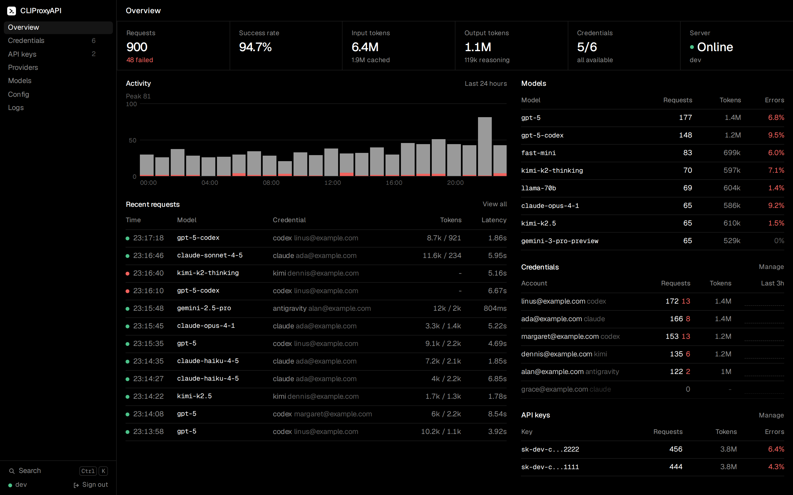

# cliproxyapi-rs

A Rust port of [CLIProxyAPI](https://github.com/router-for-me/CLIProxyAPI): one local endpoint that speaks the OpenAI, Claude, Gemini and Codex APIs and routes requests to your CLI subscriptions (Claude Code, Codex, Antigravity, Kimi, xAI, ...) and API keys, with failover, cooldowns and a management UI.



## Run

```sh
cd ui && bun install && bun run build && cd ..
cargo build --release
./target/release/cliproxy --config config.yaml
```

`config.example.yaml` documents every option; existing CLIProxyAPI configs and auth directories work unchanged. Log in to a provider with `--claude-login`, `--codex-login`, `--antigravity-login` and friends, or from the UI at `http://localhost:8317/management.html`.

## Compatibility

Verified against the Go implementation:

- **Translators:** 5,684 / 5,684 golden cases, captured from the Go test suite and replayed through the Go code (`cargo run --release -p cpa-conformance`).
- **End to end:** 669 / 669 HTTP and websocket scenarios against a mock upstream, recorded from the Go binary ([report](conformance/e2e/report.md), `cargo run --release -p cpa-e2e -- check --server $PWD/target/release/cliproxy`).

Not ported: realtime/WebRTC endpoints, plugins, the Home control plane, the Redis queue, the TUI, and TLS fingerprinting.

## License

MIT, including the original CLIProxyAPI notice.
